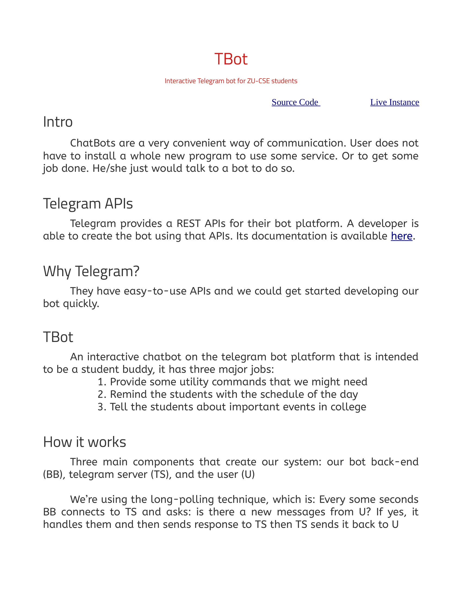
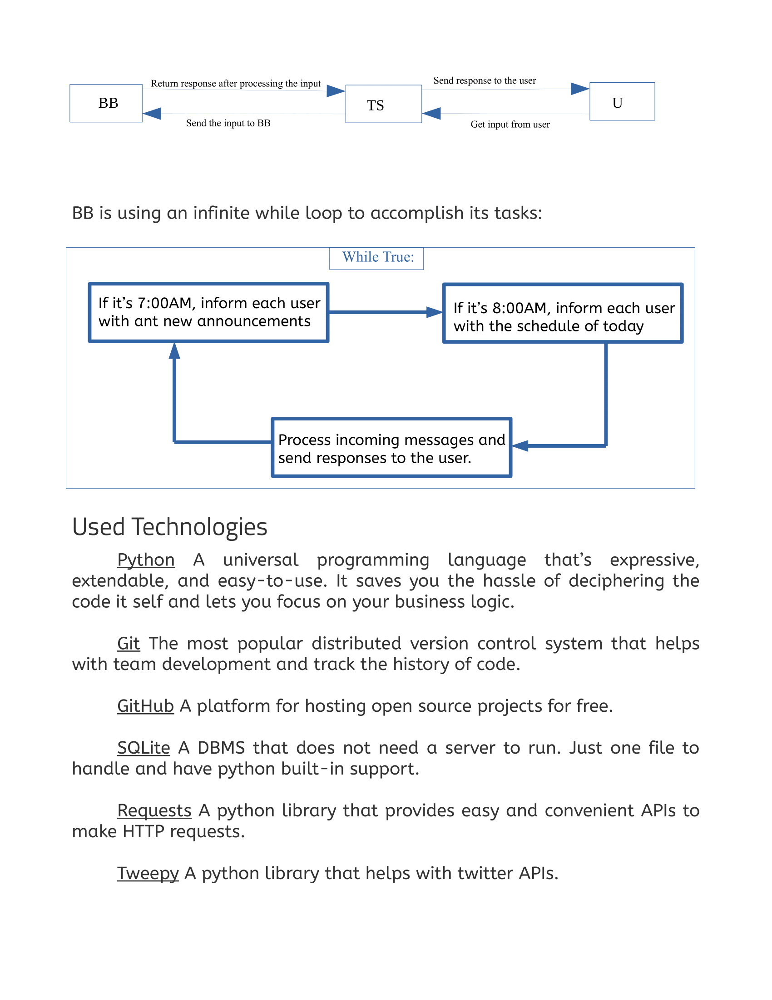
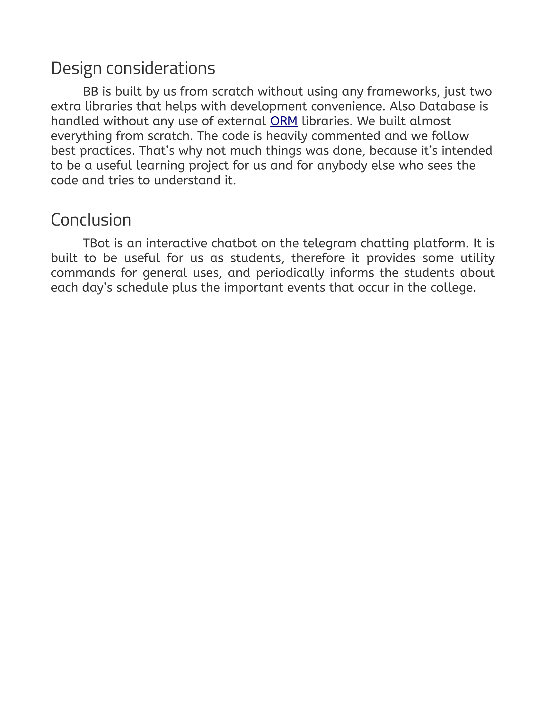

[**Wait for TBot 2!!**](https://github.com/AhShXyZ/tearobot2)

## TBot

A toy telegram-bot built using Python. Meant for educational purposes.

[Click here to try it](https://t.me/tearobot) -- *Might not work all the time*

## Live working Commands

* `/help` - Show help message
* `/translate` - Translate message from english to arabic
* `/weather` - Weather in `Zagazig, Egypt` now
* `/calculate` - Calculate mathematical expression
* `/tweet` - Tweet to our Twitter account
* `/ocr_url`  - extract text from image using its url

**Other coded features but not live:**

* `/stop`  - stop recieving messages from bot
* TBot will send the schedule to each registered user everyday at 8:00AM
* TBot informs user with new annoucements everyday at 7:00AM

**Overview of TBot:**

